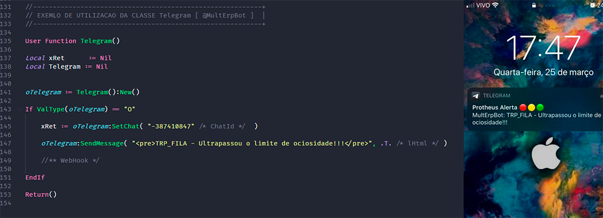

# Protheus x Telegram

Estrutura básica de integração entre ERP Protheus x Telegram. O modelo a seguir contempla apenas o envio de mensagens. A recepção\resposta será disponibilizada em um outro momento com duas opções sendo que a primeira será utilizada um JOB para ficar monitorando o recebimento de mensagens já o segundo será utilizado a criação de um WebHook que na minha opinião é a melhor opção.


Veja como é simples a chamada:




# O que posso fazer com bots no Telegram? 


As possibilidades são infinitas. Para nomear apenas algumas delas, podemos citar:

- [x] Notificar e monitorar eventos do ERP.
- [x] Realizar aprovações de pedidos e titulos do ERP.
- [x] Pode ser definido comandos ao Bot-Telegram para que o mesmo solicite  informações ao ERP. 
- [x] Serviços de redes sociais e muito mais.

<b>Atenção:</b> Através deste modelo de integração já é possível implementar o primeiro item desta lista pois não exige resposta.


# Como utilizar?

```
1. Primeiro passo é ter um Telegram Bot. 

    1.1 -   Para criá-lo, abra seu app do Telegram, busque por: @BotFather e clique sobre ele. 
    1.2 -   Envie o comando: /newbot.
    1.3 -   Insira um nome para o seu bot. (Exemplo: Bot Teste)
    1.4 -   Insira um username. O username obrigatoriamente tem que terminar com a palavra bot. Ex: MultErpbot, MeuRobo_bot.
    1.5 -   Feito isso, você receberá um Token. Ele será usado para a integração com a Protheus então copie ou salve em algum documento. 
    1.6 -   Para enviar mensagens para um determinado chat será preciso obter o ID do bate-papo, neste caso faça o seguinte, inclua-o em grupo por exemplo.
    1.7 -   Após adiciona-lo ao grupo abra o browse e cole o seguinte endereço:
 
            https://api.telegram.org/bot <YourBOTToken> /getUpdates
            
            Ex: Substitua o <YourBOTToken>  pelo seu Token.
            
            Caso tenha ocorrido tudo certo será exibido um JSON com os dados do chat. Procure o objeto "chat" e guarde o numero correspondente pois ele também será utilizado na integração.

            {"update_id": 8393, "message": {"message_id": 3, "de": {"id": 7474, "first_name": "AAA"}, "chat": {"id":803967136, "título ":" "}," date ": 25497," new_chat_participant ": {" id ": 71," first_name ":" NAME "," username ":" YOUR_BOT_NAME "}}}
    
    1.8 - Para mais detalhes acesse a página oficial do Telegram: https://core.telegram.org/bots#6-botfather  
 

2. Faça o ajuste do fonte Telegram.prw substituindo o Token e o Chat Id que foi gerado pelo bot.
3. Agora é só compilar e executar ! 
```


## Tecnologias

Projeto desenvolvido em:

- [Advpl](https://tdn.totvs.com/display/tec/AdvPL)

